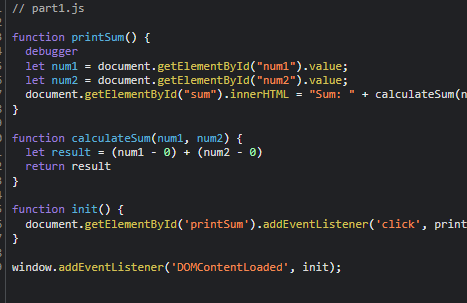

# DevTools Part 2

1. The bug is that the numbers are being stored as a string, so when they are being added, they are being concatenated together rather than being added.
2. I would fix it by somehow converting num1 and num2 into numbers before adding them together. One way to do this is by subtracting them by 0, which automatically converts the strings to numbers.
